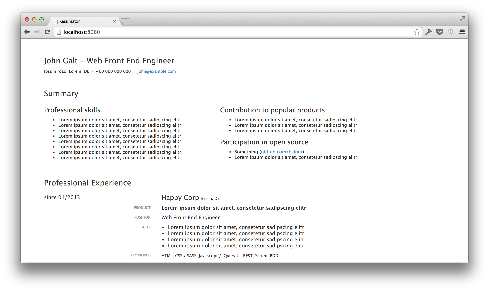

# Resumator

A little resume generator written in Javascript. It basically takes some resume information and compiles it into a HTML/CSS based resume.

Optimize for print.

## Install

    npm install
    bower install

## Usage

Edit the resume data:

    vi public/data/resume.json

Start the development server:

    npm start

Visit the resume in the browser:

    open http://localhost:8080

## Initial implementation

- Resume data in JSON format
- Compiler
- Template + Stylesheets

## License

See [MIT-LICENSE](MIT-LICENSE).
